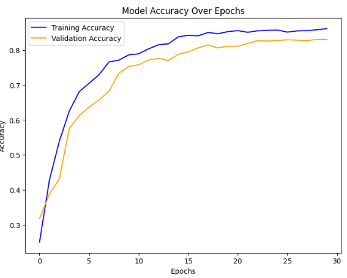
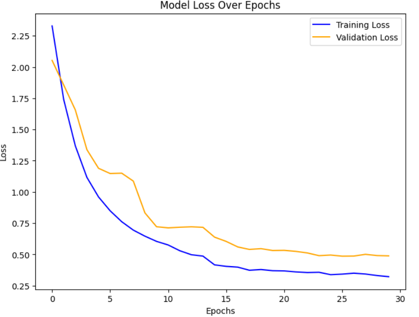
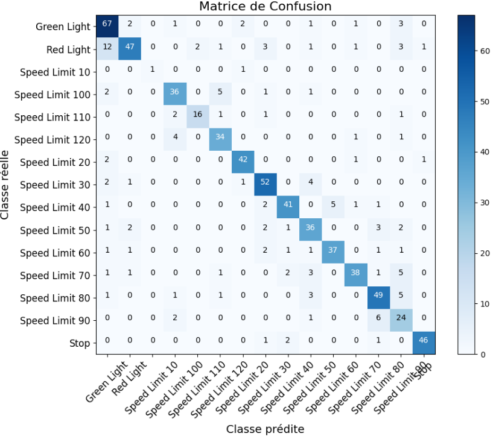

# 🚦Road Violation Detection🚦

## 🎯 Objectif

Développer un modèle de classification basé sur CNN pour détecter les infractions au code de la route dans les images, en se concentrant sur :
- **Feux de circulation** (Green, Red)
- **Panneaux de limitation de vitesse** et **STOP**

Une interface graphique interactive permet de charger une image et d’afficher les prédictions avec probabilités.

<p align="center">
  
</p>
---

## 📊 Base de Données
- **DataSet = https://drive.google.com/drive/folders/1_84ouwGTOg_nGTroiM7brgEZVby8QU7l**  
- **Nombre de classes** : 15
- **Format des annotations** : Darknet
- **Prétraitement réalisé** : Images copiées dans des dossiers par classe et redimensionnées à 224×224 pixels.

**Train/Validation/Test split** : Déjà organisé dans le dataset, traité via ImageDataGenerator.

## ⚙️ Étapes du Projet

### Étape 1: Prétraitement et organisation des données
- Copie des images dans des répertoires par classe.
- Normalisation des pixels [0,1] et augmentation de données (rotation, translation, zoom, flip).

### Étape 2: Définition du modèle CNN (transfer learning)
- MobileNetV2 pré-entraîné sur ImageNet, tête personnalisée avec GlobalAveragePooling2D, Dense et Dropout.
- Fine-tuning des dernières couches pour adapter au dataset.

### Étape 3: Entraînement
- Optimiseur : Adam (lr=0.0001)
- Loss : sparse_categorical_crossentropy
- Callbacks : EarlyStopping et ReduceLROnPlateau
- Époques : 30

### Étape 4: Évaluation
- Accuracy sur test set : ~0.82
- Visualisation des courbes de loss et accuracy pour train et validation et la matrice de confusion .
<p align="center">
  
</p>
<p align="center">
  
</p>
<p align="center">
  
</p>

### Étape 5: Interface Graphique
- Développée avec Tkinter pour charger une image et afficher les prédictions avec probabilités.

## 🖥️ Interface Graphique
- Charger des images locales via bouton.
- Afficher les prédictions de classes et probabilités.
- Aucune dépendance externe requise pour l’UI (Tkinter + PIL).

## 🛠️ Installation et Exécution

### Prérequis
- Python 3.6+
- Bibliothèques Python : TensorFlow, NumPy, Pandas, PIL, Tkinter, keras, matplotlib
  
### Étapes
1. Clonez le dépôt :
   ```bash
   git clone https://github.com/eyazaoui123/RoadViolationDetection.git
   cd RoadViolationDetection
2. Installer les requirements
3. Excécuter le fichier main.py

## 📁 Repository Structure

```
RoadViolationDetection-main/
│
├── main.py                     # Interface graphique Tkinter
├── labels.csv                  # Noms des classes
├── road_violation_model3.keras # Modèle entraîné
├── training_model.ipynb        # Notebook d’entraînement
├── screenshots/                # Captures d’écran UI
├── requirements.txt            # Dépendances Python
└── README.md

```

## 🔮 Perspectives / Travaux Futurs

- **Extension et équilibrage de la base de données** : Utiliser un dataset plus volumineux et équilibré pour améliorer la généralisation, notamment pour les classes sous-représentées.
- **Matériel plus performant** : Entraîner le modèle sur des GPU plus puissants permettrait d’expérimenter des réseaux plus profonds ou des résolutions d’images plus grandes, améliorant les performances.
- **Architectures avancées** : Tester des CNN plus sophistiqués (EfficientNet, ResNeXt) ou des approches par ensemble pour accroître la précision.

## 👩‍💻 Author

**Eya Zaoui**
- 💼 AI & Software Engineer | | Expert in Machine Learning, Deep Learning, and Computer Vision
- 📧 Email: zaouieya2@gmail.com
- 🔗 LinkedIn: [linkedin.com/in/eya-zaoui](linkedin.com/in/eya-zaoui)
